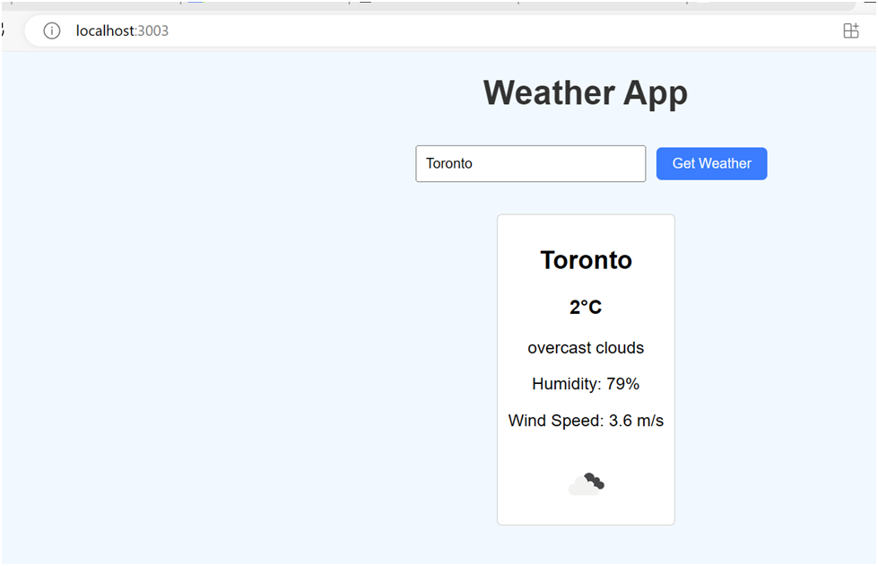
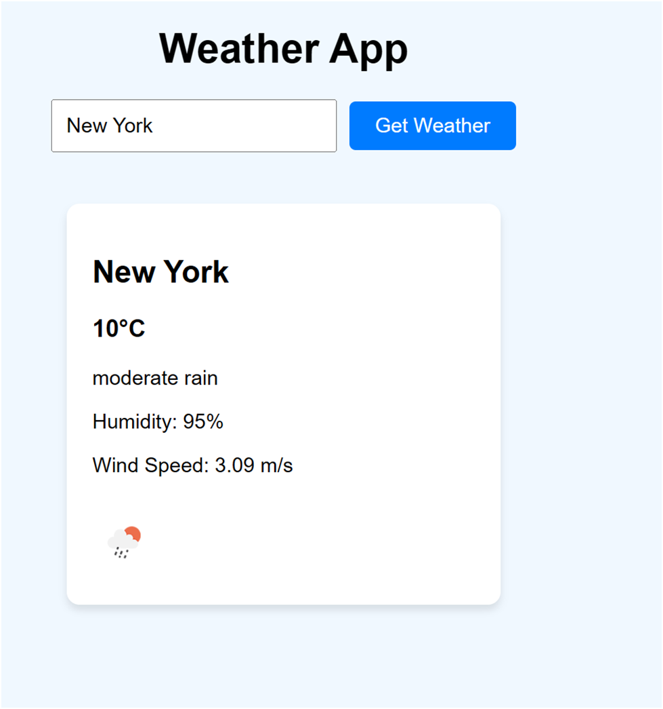
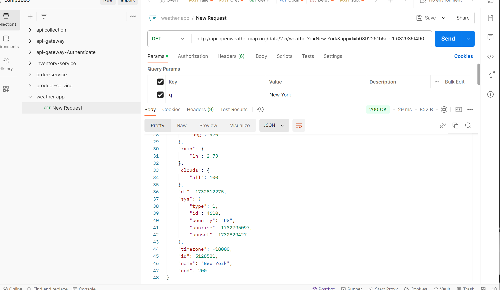
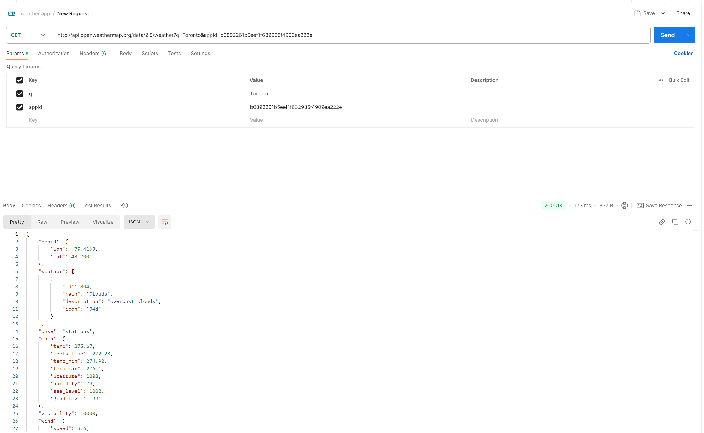

# Weather App

# NAME: Fatima Arab
 # Student id:101463256

 This is a ReactJS app that allows users to fetch and show real-time weather details for any city using the OpenWeatherMap API.

 # This is the image of default location, Toronto
 

# This is the weather information for New York and its postman

# THis is postman for Toronto
